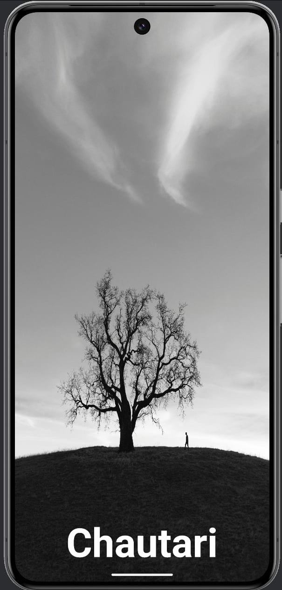
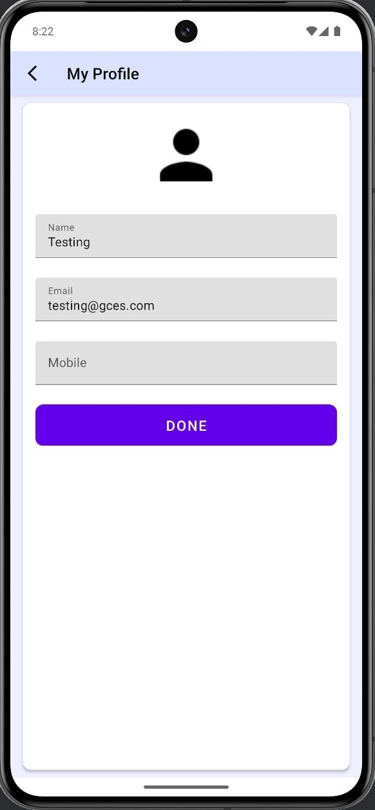

# Chautari
## Mobile App Development Project

"CHAUTARI" is a mobile app built in Kotlin that allows users to manage projects efficiently.

## Features 
Firebase Authentication

SQLite for CRUD operations

XML-based UI design

Kotlin programming language

Required permissions for smooth functionality

## Splash

## Login UI

## Register UI

Thank you! Stay tuned for "Chautari"