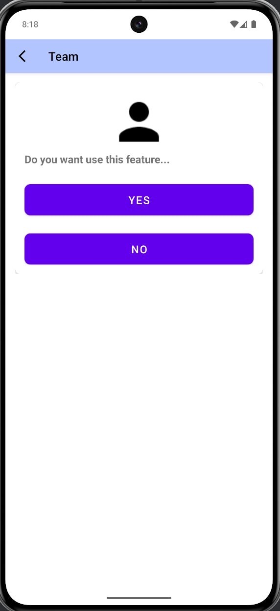
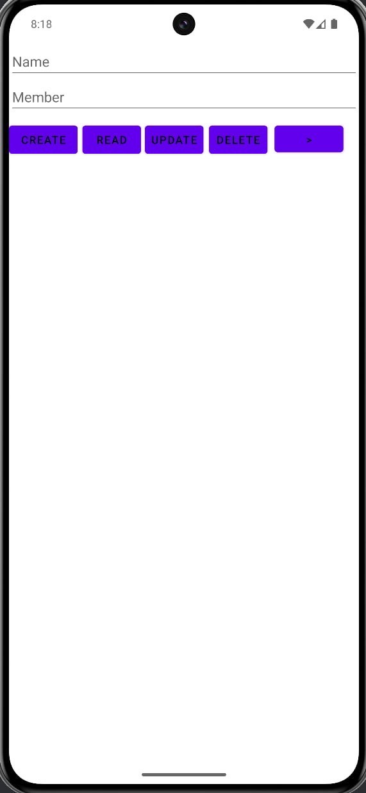

# Chautari
## Mobile App Development Project

"CHAUTARI" is a mobile app built in Kotlin that allows users to manage projects efficiently.

Login UI

Register UI

Phase 1

Features :

# Team Management:

Create, read, update, and delete teams using SQlite

Thank you! Stay tuned for "Chautari"